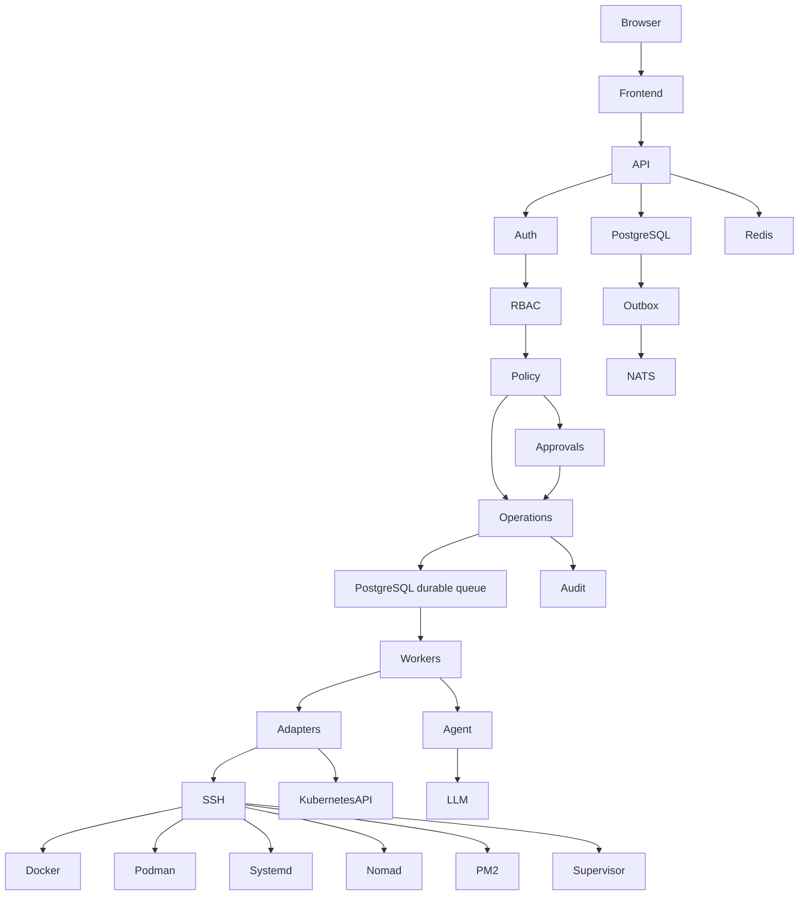

# infra-orchestrator

[](https://github.com/thiagomontozo/infra-orchestrator/actions/workflows/ci.yml)

[](LICENSE)

Control plane de infraestrutura com backend Go e interface React/TypeScript. Gerencia inventário remoto, operações auditadas, aprovações, containers, serviços e diagnósticos por LLM. O nome exibido é configurável por `APP_NAME`.

> Código em desenvolvimento ativo. Consulte [a matriz de implementação e validação](docs/STATUS.md) e [o relatório de testes](docs/TEST_RESULTS.md) antes de usar em produção. Testes com fixtures não representam certificação de clusters ou provedores externos.

## Iniciar

Requisitos: Docker Engine/Compose, acesso de rede aos hosts e fingerprints SSH obtidas por canal confiável. Para desenvolvimento nativo: Go **1.26.6+**, Node 24 e npm.

```powershell
./scripts/bootstrap.ps1
# Edite .env: OUTBOUND_ALLOWED_CIDRS, origem e configuração do ambiente.
docker compose -f compose.yml -f compose.dev.yml up --build -d
docker compose exec server /app/infra-orchestrator admin create --username seu-admin --email admin@example.com
```

Linux/macOS:

```sh
./scripts/bootstrap.sh
# Edite .env. Para desenvolvimento: APP_ENV=development, PUBLIC_ORIGIN=http://localhost:8080
docker compose up --build -d
docker compose exec server /app/infra-orchestrator admin create --username seu-admin --email admin@example.com
```

Acesse `http://localhost:8080` em desenvolvimento. Não há credencial padrão. A senha inicial é solicitada sem eco; `--password-stdin` atende automações. Em produção, use HTTPS com proxy reverso e `PUBLIC_ORIGIN` correspondente. A configuração de produção rejeita origem HTTP.

## Fluxos principais

1. **Hosts:** adicionar endereço, usuário não root, chave e ambiente; obter fingerprint; comparar por um canal confiável; confirmar; salvar; testar SSH; descobrir.
2. **Containers:** selecionar recurso; consultar status/logs; solicitar ação e informar motivo; acompanhar Operações. Alterações em produção aguardam um aprovador diferente do solicitante.
3. **Criar container/microsserviço:** selecionar host Docker já descoberto, imagem, registry, portas, variáveis e limites. O worker baixa a imagem usando a API do Docker sobre SSH, cria e inicia o container. Credenciais de registry não são gravadas em `docker login` remoto.
4. **Kubernetes:** usar `kubectl` já configurado no host ou cadastrar kubeconfig incorporando CA/token/certificado. Plugins `exec` e TLS inseguro são rejeitados.
5. **IA:** cadastrar provedor compatível com `/v1/models` e `/v1/chat/completions`, configurar CIDRs de saída, testar, selecionar um recurso e analisar. A resposta distingue fatos, hipóteses e ações. Tools seguem RBAC/policy/aprovação.
6. **Console:** abrir a aba Console de um container ou serviço compose para um shell interativo com PTY. Exige `container.exec`, concedida a `OPERATOR` e `ADMIN` em todos os ambientes e **sem aprovação de segunda pessoa**, inclusive em produção. Comandos digitados não entram na auditoria. Ver [Console](docs/CONSOLE.md).

## Segurança por arquitetura



Não existe endpoint de shell. O executor aceita programas definidos pelo código; adapters validam identificadores e constroem argumentos escapados. A IA não recebe credenciais nem permissão para executar CLI. Senhas usam Argon2id; credenciais e manifestos usam AES-256-GCM com identificação autenticada, ou Vault KV v2.

## Processos

- `cmd/server`: API, autenticação, scheduler e worker embutido opcional.
- `cmd/worker`: execução remota, reconciliação, coleta, notificações e monitoramento de anomalias.
- `cmd/cli`: `admin create`, `admin reset-password`, `migrate`, `health`, `version`.
- `web`: React/Vite. Containers de frontend fazem proxy para a API; o binário também serve `web/dist` para desenvolvimento local.

PostgreSQL armazena todo o estado crítico. Redis limita requisições quando configurado. NATS JetStream recebe eventos da outbox; a fila de comandos continua transacional no PostgreSQL. Nenhuma dependência de entrega do NATS é usada para repetir comandos destrutivos.

## Desenvolvimento e testes

```sh
go test ./...
go vet ./...
cd web
npm ci
npm run lint
npm test
npm run build
```

Integrações e navegador exigem variáveis próprias, conforme [TESTING](docs/TESTING.md). Não interpretar testes pulados como testes aprovados. CI inclui dependências, segredos e containers.

## Documentação

- [Arquitetura](docs/ARCHITECTURE.md), [Segurança](docs/SECURITY.md), [Banco e HA](docs/HIGH_AVAILABILITY.md)
- [Autenticação](docs/AUTHENTICATION.md), [RBAC](docs/RBAC.md), [Políticas](docs/POLICY_ENGINE.md)
- [SSH](docs/SSH.md), [Bastion](docs/BASTION.md), [Secrets](docs/SECRETS.md)
- [Adapters](docs/ADAPTERS.md), [Criação de serviços](docs/PROVISIONING.md), [Kubernetes](docs/KUBERNETES.md)
- [Operações](docs/OPERATIONS.md), [Deployments](docs/DEPLOYMENTS.md), [Agentes](docs/AGENT.md)
- [Console interativo](docs/CONSOLE.md)
- [API](docs/API.md), [OpenAPI](docs/openapi.yaml), [Instalação](docs/DEPLOYMENT.md)
- [Relatório final](docs/FINAL_REPORT.md), [Limitações](docs/STATUS.md)

Licença: [Apache-2.0](LICENSE).
