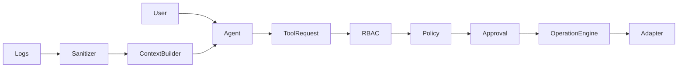

# Segurança do agente

System policy e instruções confiáveis são separados de `untrusted_data`: logs, labels, annotations, saída remota e status nunca autorizam ferramentas. Uma linha que pede para apagar containers permanece evidência não confiável. Validação estrutural, allowlist de tools, associação ao recurso e autorização no backend constituem a barreira de execução, independentemente da obediência do modelo ao prompt.

Contextos de logs são truncados por linhas/bytes e sanitizados para Bearer, JWT, Authorization, passwords, chaves, cookies e URLs de conexão. Campos JSON sensíveis e arrays Env são removidos em consultas. Sanitização por regex não garante encontrar todo segredo possível em texto livre: não envie logs com segredos cuja classificação não esteja coberta. Regras customizadas por tenant e DLP externo ainda não estão disponíveis.

Testes incluem output malicioso, tentativa de tool desconhecida, alteração de resource_id e escalada de modo/ação. Não existe promessa de eliminar prompt injection por instrução textual. O backend nunca interpreta uma resposta da LLM como autorização administrativa.
