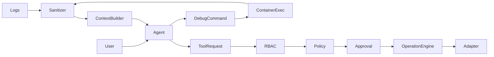

# Segurança do agente

```mermaid
flowchart LR
    Logs --> Sanitizer
    Sanitizer --> ContextBuilder
    User --> Agent
    ContextBuilder --> Agent
    Agent --> DebugCommand
    DebugCommand --> ContainerExec
    ContainerExec --> Sanitizer
    Agent --> ToolRequest
    ToolRequest --> RBAC
    RBAC --> Policy
    Policy --> Approval
    Approval --> OperationEngine
    OperationEngine --> Adapter
```

System policy e instruções confiáveis são separados de `untrusted_data`: logs, labels, annotations, saída remota e status nunca autorizam ferramentas. Uma linha que pede para apagar containers permanece evidência não confiável. Validação estrutural, allowlist de tools, associação ao recurso e autorização no backend constituem a barreira de execução, independentemente da obediência do modelo ao prompt.

Contextos de logs são truncados por linhas/bytes e sanitizados para Bearer, JWT, Authorization, passwords, chaves, cookies e URLs de conexão. Campos JSON sensíveis e arrays Env são removidos em consultas. Sanitização por regex não garante encontrar todo segredo possível em texto livre: não envie logs com segredos cuja classificação não esteja coberta. Regras customizadas por tenant e DLP externo ainda não estão disponíveis.

## Modos DEBUG e CHAT: a barreira estrutural sai de cena

Os laços com execução (`POST /api/v1/agents/debug` e `POST /api/v1/agents/chat`, ver [CONSOLE.md](CONSOLE.md)) mudam essa análise por decisão explícita do operador. Nele o modelo escolhe comandos livres executados dentro do container, e o backend deixa de ser a allowlist: a autorização é verificada uma vez, no início, e vale para todos os comandos da sessão. A consequência precisa ser dita sem rodeio: uma linha de log, um label ou a saída de um comando anterior que peça algo ao modelo pode influenciar o comando seguinte, e esse comando roda de verdade. A separação entre instrução confiável e `untrusted_data` continua no prompt, mas passa a ser mitigação, não garantia.

O que continua valendo: o alvo é um único container, escolhido pelo backend a partir do recurso, e o script chega ao runtime como um argumento citado — nem o modelo nem a saída que ele lê alcançam a linha de comando do host, outro container ou outro recurso. Quem dispara precisa de `container.exec` no ambiente, ou seja, já poderia digitar os mesmos comandos no console. Toda a sessão é gravada, comando a comando, o que o console interativo não faz. Mutações via tool seguem no caminho antigo, com RBAC, política e aprovação.

O chat vai um passo além do DEBUG: sua política autoriza alterar o conteúdo do container quando a pessoa pede uma correção. Isso amplia a superfície — uma injeção bem colocada não precisa mais convencer o modelo a "só olhar" —, e a contrapartida é que a pessoa está no laço a cada troca, lendo os comandos executados antes de mandar a próxima mensagem. Um histórico longo também é superfície: o que a IA leu numa troca anterior volta resumido para as seguintes.

A transmissão ao vivo tem uma limitação própria, e ela é de projeto: `security.Redact` reconhece um segredo por padrão completo, e o texto chega caractere a caractere. Enquanto um campo ainda está sendo escrito, tudo a partir do primeiro gatilho de segredo — `password`, `token`, `bearer`, `eyJ`, `-----BEGIN`, `://` e afins, inclusive gatilhos pela metade no fim do texto — fica retido e só sai quando o campo fecha, já redigido. Se a redação reescrever texto que já saiu, o stream para de avançar em vez de emitir um trecho corrompido, e a mensagem gravada, redigida por inteiro, continua correta. Vale notar o que **não** passa por esse caminho: a saída de comando, que é onde segredos de verdade aparecem, só é emitida depois de `security.Redact` sobre o texto completo. O que segue por delta é a prosa do próprio modelo.

Conversas são privadas de quem as abriu, inclusive de ADMIN, pela rota de chat. Isso é escolha de privacidade do texto, não de auditoria: todo comando executado aparece em `agent.exec` com autor, container, comando, status e duração, independentemente de quem lê a conversa.

Consequência prática para quem opera: trate uma sessão de depuração ou uma conversa como um shell aberto pelo usuário que a pediu, não como uma consulta de leitura. Em `production`, prefira provedores LLM com `environment` fixado e revise `agent.exec` na auditoria.

Testes incluem output malicioso, tentativa de tool desconhecida, alteração de resource_id, escalada de modo/ação e a tentativa de escapar do container pelo script de depuração. Não existe promessa de eliminar prompt injection por instrução textual. O backend nunca interpreta uma resposta da LLM como autorização administrativa.
